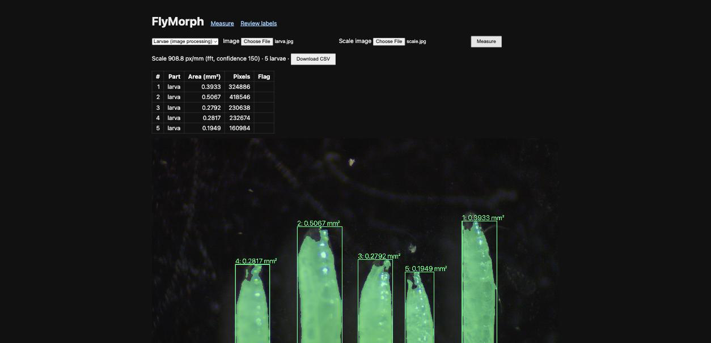
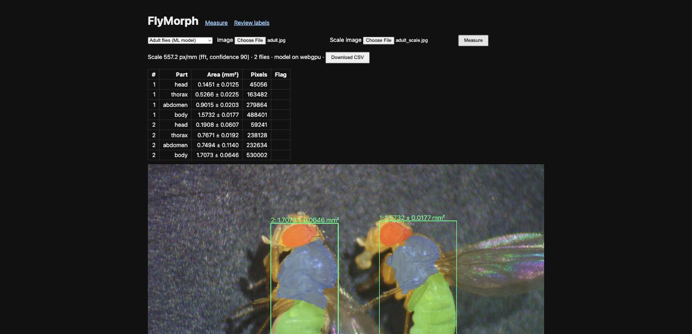

# FlyMorph

Measure *Drosophila* larvae and adult flies in mm² from stereo-microscope photos, in the browser or from the command line.

- **Larvae**: a classical computer-vision pipeline in plain TypeScript (Otsu threshold → morphology → hole filling → connected components → shape checks).
- **Adult flies**: head / thorax / abdomen area from **FlyNet**, a 1.66 M-parameter U-Net distilled from Meta's Segment Anything (SAM) via human-reviewed drafts. It runs on WebGPU in the browser and reports every area as **mean ± SD** from Monte Carlo dropout.
- **Scale**: pixels per mm read automatically from a stage-micrometer photo with an FFT of its tick spacing, with a two-click fallback.





## Quickstart

```bash
npm install
npm run dev                 # web app → http://localhost:5173
npm test                    # 47 unit tests on the core

# batch a whole imaging session to CSV
npx tsx apps/cli/src/main.ts larva "path/to/session" --scale "path/to/session/scale.jpg" --out larvae.csv
npx tsx apps/cli/src/main.ts adult "path/to/session" --scale "path/to/session/scale.jpg" --out flies.csv
```

## How it's built

```
packages/core   pure TypeScript over typed arrays: image ops, larva pipeline, FFT calibration, adult post-processing
apps/web        Vite + React: measure page (Web Worker for pixel loops) and #/review label page
apps/cli        Node: same core, sharp for decoding, onnxruntime-node for the model
ml/             Python: manifest → SAM drafts → review server → train → evaluate → ONNX export
site/           the step-by-step build course (node site/build.mjs)
```

The ML loop:

1. `ml/manifest.py` indexes every photo by content hash and groups them into imaging sessions.
2. `ml/sam_draft.py` finds each fly, works out its long axis and which end the head is on, then prompts SAM for each part.
3. `ml/draft_server.py` plus the web app's `#/review` page let a person approve, reject, flip or re-prompt each draft. **Only approved masks are ground truth.**
4. `ml/train.py` trains FlyNet (ImageNet-pretrained MobileNetV3-small encoder, cross-entropy + Dice loss) on a split by imaging session.
5. `ml/evaluate.py` reports Dice, median per-fly area error and ±2 SD coverage on held-out sessions.
6. `ml/export.py` exports ONNX, checks it against PyTorch, and copies it into the web app.

## Results

FlyNet v1, trained on 63 human-approved photos and scored against human-approved masks on 17 photos from 6 imaging sessions it never saw (`ml/results/v1-masks-metrics.json`):

| Part | Dice | Median area error | Inside ±2 SD |
|---|---:|---:|---:|
| head | 0.83 | 16% | 5% |
| thorax | 0.80 | 21% | 19% |
| abdomen | 0.89 | 6% | 36% |
| body | 0.90 | 12% | 19% |

- Reviewing labels mattered: the same model trained on unreviewed SAM drafts reached 0.58–0.69 validation Dice; on reviewed masks, 0.83–0.90.
- Repeatability: seven repeat photos of the same two flies give body areas of 1.90–1.99 mm² and 2.26–2.42 mm² (about ±3%).
- The error bars are still over-confident: ±2 SD should contain ~95% of true areas, and it contains 5–36%. Calibrating the SD on the validation set is the next step.
- Body-plan rules (thorax between head and abdomen, no gaps, head smallest, no part split in two) raise 0 false alarms on the 94 approved photos and flag 12 of 60 unapproved drafts.

Larva pipeline, checked on real images:
- The old fixed threshold (V > 95) cut into translucent larvae; Otsu follows the true edge (+7–15% area on the same image).
- Repeat photos of the same larvae agree within ~1%.
- Scale calibration succeeds on 63 of 75 real micrometer images with zero false accepts; the rest fall back to two clicks.

## Limitations

- Touching flies are measured as one fly. Larvae touching background objects are flagged `irregular`, not separated.
- The scale photo must be taken at the same zoom as the specimen photo.
- FlyNet has only seen one lab's microscope and backgrounds. A new setup needs a few new labels.
